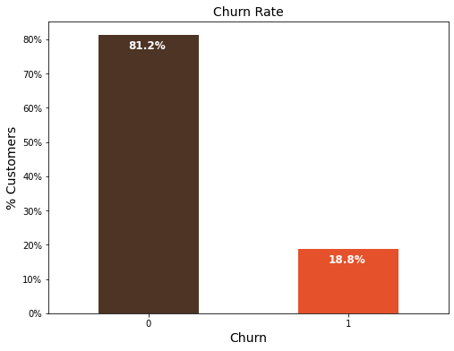

#  Expressor Customer Churn Prediction, ML Approach
<p align="center">
  
</p>

## Project Overview
In this project, we seek to determine the possibility that a client would leave the business, the primary churn indicators, as well as the retention tactics that may be used to avoid this issue. One of the main issues facing the telecom sector is churn. According to studies, the top 4 wireless providers in the US see an average monthly churn rate of 1.9% to 2%.

One of any company's largest expenses is customer churn. The percentage of consumers who ceased using your company's product or service within a predetermined duration is known as customer churn, also known as customer attrition or customer turnover. For instance, if you started the year with 500 clients and completed it with 480, then 4% of those 500 customers went. It would greatly aid the company in strategizing their retention campaigns if we could determine why a client leaves and when they leave with some degree of accuracy.

## DESCRIPTION
The project aims to analyze and forecast the number of products sold per stores per weeks for a neighborhood grocery store, the goal is to develop a model that can accurately anticipate future sales using data from 54 different stores and 33 different products collected from the same country. In order to assist the management of the business develop inventory and sales plans.

## OBJECTIVE
Using historical sales data from the Grocery sales over the last years have accumulated a lot of data, we will utilize sales forecasting to forecast future sales levels for a company.

Our goal is to assist business managers in forecasting the future using this data, which has been stored on file for a predetermined amount of time after the event or after it occurred.

to build models use those models to make observations, and use them to guide future strategic decision-making. We would like to assist management at the grocery shop in gathering some insights from their data in order to improve operations and eventually revenue.


<p align="center">
  
</p>


With this solution, we hope to help the grocery store's management make observations, extract some insights from their data to improve operations and ultimately revenue, and use those insights to inform their future strategic decisions. 


## The presentation follows the following outline

- [Project Overview](#project-overview)
- [Getting Started](#getting-started)
- [Data](#data)
- [Modeling](#modeling)
- [Evaluation](#evaluation)
- [Deployment](#deployment)


## Objectives

- Objective 1: Data Exploration
- Objective 2: Data Preprocessing
- Objective 3: Model Selection and Training
- Objective 4: Model Evaluation
- Objective 5: Results & Analysis
- Objective 6: Deployment and Future Improvements


## Summary
| Code | Name                                                | Summary of the work                                                                                          |                                                                                              Streamlit App    |                                                                                                |
|------|-----------------------------------------------------|------------------------------------------------------------------------------------------------------------|--------------------------------------------------------------------------------------------------------------|-------------------------------------------------------------------------------------------------------------|
| Capstone  | Expressor Sales Forecasting And Analysis Of The Grocery Stores, ML Approach     | [Summary_PPT](https://www.canva.com/design/DAFsXnEpF0Q/SInfoc-gtCJ5Wxc-QYaudg/edit?utm_content=DAFsXnEpF0Q&utm_campaign=designshare&utm_medium=link2&utm_source=sharebutton) |  [Streamlit App](https://huggingface.co/spaces/HOLYBOY/Customer_Churn_App)      |


## Project Setup

To set up the project environment, follow these steps:

1. Clone the repository:

git clone my_github 

```bash 
https://github.com/justinjabo250/Sales-Forecasting-And-Analysis-Of-The-Grocery-Stores
```

2. Install the required dependencies:

```bash
pip install -r requirements.txt
```

3. Create a virtual environment:

- **Windows:**
  ```bash
  python -m venv venv
  venv\Scripts\activate
  ```

You can copy each command above and run them in your terminal to easily set up the project environment.


## Data

The data set used in this project was sourced from the [Zindi](https://zindi.africa/competitions/grocery-store-forecasting-challenge-for-azubian/data).


## Data set Description

| Column Name         | Type            | Description                                                                             |
|---------------------|-----------------|-----------------------------------------------------------------------------------------|
| Target              | Categorical     | Total sales for a product category at a particular store at a given date                                              |
| Stores_id           | Numeric         | the unique store id                                               |
| Category_id         | Numeric         | the unique Product category id                                                            |
| Date                | Numeric         | date in numerical representation                                    |
| Onpromotion         | Numeric     | gives the total number of items in a Product category that were being promoted at a store at a given date                                            |
| Nbr_of_transactions | Numeric         | The total number of transactions happened at a store at a given date                                         |
| year_weekofyear     | Numeric         | the combination of the year and the week of the year, (year_weekofyear = year*100+week_of_year)                             |
| ID    | Numeric         | the unique identifier for each row in the testing set: year_week_{year_weekofyear}_{store_id}_{Category_id}                                                   |


## Exploratory Data Analysis

During the exploratory data analysis (EDA) phase, a comprehensive investigation of the Grocery store dataset was conducted to gain insights through various types of analyses.

- **Univariate analysis:** A thorough examination of each variable individually was performed. Summary statistics such as mean, median, standard deviation, and quartiles were calculated to understand the central tendency and spread of the data.

<p align="center">
  
</p>

- **Bivariate analysis:** Relationships between pairs of variables were explored to identify patterns and potential predictor variables for products sold.

<p align="center">
  
</p>

- **Multivariate analysis:** Relationships among multiple variables were examined simultaneously, allowing for a deeper understanding of the number of products sold per store per week for a local grocery store.

<p align="center">
  
</p>

### Hypotheses:
1. Customers with longer tenure are less likely to churn than those with short tenure.

2. Customers with lesser income are likely to churn than those who have higher

These hypotheses, along with the results of the EDA, contribute to a deeper understanding of the dataset and provide valuable insights for further analysis and model development.

### Business Questions
1. What is the relation of the preditor class (Churn) to other variable
- Churn rate
- Churn vrs. Tenure
2. What type of services offered by the telecom industry (Expressor)

3. What is the average tenure of customers?

## Modeling

During the modeling phase, the evaluation of models took into consideration the imbalanced nature of the data. The best performance evaluation estimator would be the AUC score, which provide a balanced assessment for imbalanced datasets.

We trained the underlisted six models and evaluated their performance based on Area Under the Curve (AUC)

- **Logistic Regression** 
- **Decision Tree** 
- **Random Forest** 
- **GaussianNB**
- **ComplementNB**
- **Support Vector Machine (SVM)**

These models were evaluated based on their AUC and logloss scores, providing insights into their performance on the imbalanced dataset. 


Given the imbalanced nature of our dataset, we assessed the models' performance using the AUC metric.

- Logistic Regression model emerged as th top-performing model, achieving the highest AUC scores of 80%.
- ComplementNB consistently demonstrated high performance across different conditions.
- GaussianNB had a relatively lower AUC score and higher log loss compared to other models.


### Streamlit deployment 

Navigate to the cloned repository and run the command:

```bash 
pip install -r requirements.txt
``` 
To run the demo app (being at the repository root), use the following command:
```bash 
streamlit run streamlitApp.py
```

### App Execution on Huggingface

Here's a step-by-step process on how to use the [Streamlit App](https://huggingface.co/spaces/HOLYBOY/Customer_Churn_App) on Huggingface:


## Contribution
You contribution, critism etc are welcome. We are willing to colaborate with any data analyst/scientist to improve this project. Thank your 

## Contact

`Justin Jabo` 

`Data Analyst`
`Azubi Africa`

- [](https://www.linkedin.com/in/jabo-justin-2815341a2/) 
